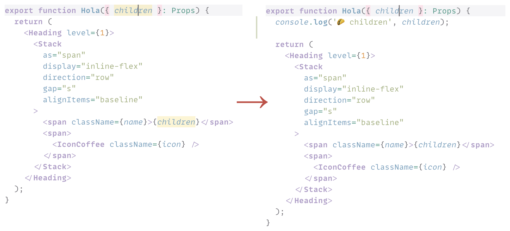

# Emoji Console Log Visual Studio Code extension

Visual Studio Code extension to insert `console.log()` statement with a random emoji and a variable (object, function, etc.) under your cursor to make debugging JavaScript and TypeScript code easier.

**[Install from Visual Studio Marketplace](https://marketplace.visualstudio.com/items?itemName=sapegin.emoji-console-log)**



_This is a fork of the [Turbo Console Log](https://www.turboconsolelog.io) extension, [see more details below](#motivation)._

## Features

- Hotkeys to add, comment, uncomment, and remove logs to monitor different values.
- Adds random emoji to each log to make it easier to distinguish different logs in the browser console.
- Automatically detects project’s code style (quotes, semicolons, tabs/spaces, etc.).

This extension adds four commands to your Visual Studio Code:

### Insert a log message

Place a cursor or select a variable that you want to log, and press **Shift+Alt+L** (Windows) or **Shift+Option+L** (Mac). A log message will be inserted in the next line relative to the selected variable like so:

```js
console.log('🦆 variable', variable);
```

Multiple cursor selection is also supported.

### Comment all log messages, inserted by the extension, in the open file

Press **Shift+Alt+C** (Windows) or **Shift+Option+C** (Mac).

### Uncomment all log messages, inserted by the extension, in the open file

Press **Shift+Alt+U** (Windows) or **Shift+Option+U** (Mac).

### Delete all log messages, inserted by the extension, in the open file

Press **Shift+Alt+D** (Windows) or **Shift+Option+D** (Mac).

## Settings

You can change the following options in the [Visual Studio Code setting](https://code.visualstudio.com/docs/getstarted/settings):

| Description | Setting | Default |
| --- | --- | --- |
| Log function to use in the inserted log message | `emojiConsoleLog.logFunction` | `console.log` |

You can also [redefine the key bindings](https://code.visualstudio.com/docs/getstarted/keybindings):

| Description | Name | Default Win | Default Mac |
| --- | --- | --- | --- |
| Insert a log message | `emojiConsoleLog.addLogMessage` | Shift+Alt+L | Shift+Option+L |
| Comment all log messages | `emojiConsoleLog.commentAllLogMessages` | Shift+Alt+C | Shift+Option+C |
| Uncomment all log messages | `emojiConsoleLog.uncommentAllLogMessages` | Shift+Alt+U | Shift+Option+U |
| Delete all log messages | `emojiConsoleLog.removeAllLogMessages` | Shift+Alt+D | Shift+Option+D |

## Motivation

Using `console.log()` is my favorite way of debugging JavaScript and TypeScript code. I’ve been trying to learn more fancy techniques, like a debugger, but I always come back to `console.log()`, because it’s the simplest and it works for me.

The way I do it is by adding a separate log for each variable I want to track, like so: `console.log('🍕 variable', variable)`. I always add a different emoji at the beginning, so it’s easy to differentiate logs in the browser console.

I wanted the easiest way to manage such logs so I found the [Turbo Console Log](https://www.turboconsolelog.io) extension that does most of what I wanted but not in a way I’d like. I decided to make a fork instead of contributing more options to the original extension because I felt my vision would be very different from the vision of the original extension.

The main differences with Turbo Console Log are:

- Significantly simpler and doesn’t come with a lot of options, doesn’t add class name, file name, line number, etc, only the variable name.
- Adds random emoji to each log
- Automatically detects project’s code style (quotes, semicolons, tabs/spaces, etc.).

## Changelog

The changelog can be found on the [Changelog.md](./Changelog.md) file.

## Sponsoring

This software has been developed with lots of coffee, buy me one more cup to keep it going.

<a href="https://www.buymeacoffee.com/sapegin" target="_blank"></a>

## Contributing

Bug fixes are welcome, but not new features. Please take a moment to review the [contributing guidelines](Contributing.md).

## Authors and license

[Artem Sapegin](https://sapegin.me), and [contributors](https://github.com/sapegin/emoji-console-log/graphs/contributors).

This extension is based on [Turbo Console Log](https://github.com/Chakroun-Anas/turbo-console-log) by [ Chakroun Anas](https://github.com/Chakroun-Anas) and its [contributors](https://github.com/Chakroun-Anas/turbo-console-log/graphs/contributors).

MIT License, see the included [License.md](License.md) file.
